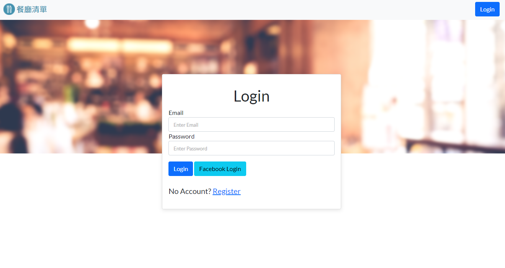

# 餐廳清單
可以建立專屬自己的餐廳清單。

<br>

## 功能
- 使用者可以註冊帳號
- 使用者可以透過Facebook Login直接登入
- 登入後，使用者可以建立並管理專屬的餐廳清單

### 環境設置
1. 安裝 node.js 與 npm
2. 將專案 clone 到本地
   ```
   https://github.com/HitomiHuang/restaurantlist_ver02.git
   ```

3. 安裝相關套件
   ```
      npm install
   ```

4. 安裝完畢，輸入以下指令，運行專案
   ```bash
   npm run start
   ```

5. 若出現此行網址代表運行順利
   ```bash
   Express is running on http://localhost:3000
   ```


### 開發工具
- Bootstrap 5.1.3
- Bcryptjs 2.4.3
- Connect-flash 0.1.1
- Dotenv 16.0.0 
- Express 4.17.2
- Express-Handlebars 3.0.0   
- Express-session 1.17.2  
- Font-awesome 5.8.1
- Handlebars 4.7.7
- Method-override 3.0.0
- Mongoose 6.1.8
- Node.js 14.16.0
- Nodemon 2.0.15
- Passport 0.5.2
- Passport-facebook 3.0.0
- Passport-local 1.0.0
